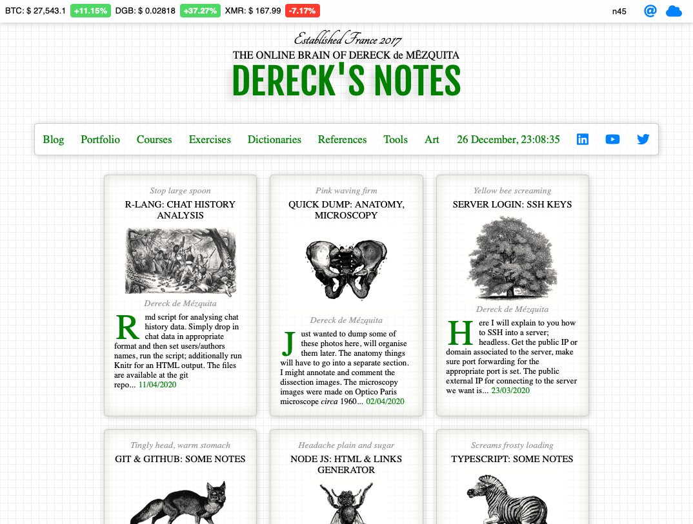
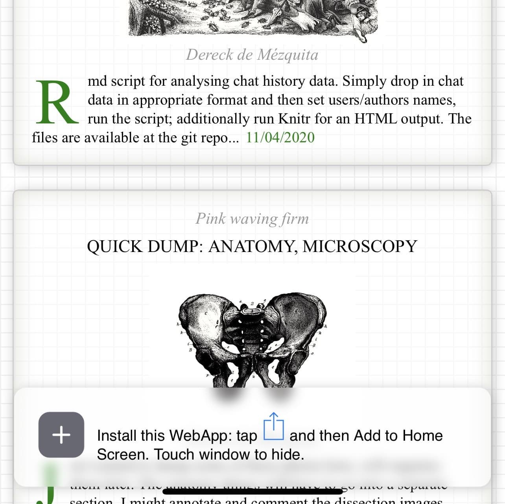
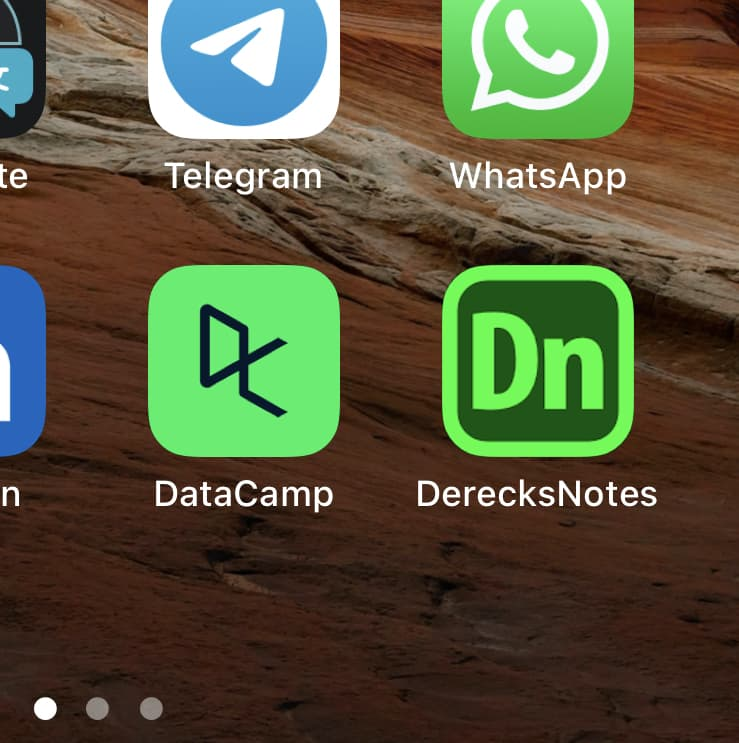

# [derecksnotes](www.derecksnotes.com) 

This repository is for tracking my personal website: [`www.derecksnotes.com`](www.derecksnotes.com). 

This very website is 100% custom made by yours truly! It took me a number of years to perfect the styling. The content is a continual effort.

A lot of the meat of the content which was previously available on my site was removed; a book is in progress!

<p align="center">
    
</p>

This website features progressive web-app technologies and thus can prompt a user and then be installed locally on a mobile phone for offline use. 

<p align="center">
    
    
</p>

# Technologies

This website is built using the following technologies:

1. JavaScript/PHP
1. HTML5/CSS3/SASS
1. R, and knited R documents
1. Progressive web app technologies
1. SQL database

PHP along with JavaScript is used for generating the entry cards you can see on the home page. Each entry has some descriptive data stored in a `.JSON` file.

SASS a more modern and likable styling langauge is used. This is compiled and bundled as a minified `CSS` file.

Interactive reports are generated through use of `.Rmd` files in R studio.

An SQL database is used for storing the data in the dictionaries and generated dynamically upon load request.

A custom comment system is in the works and should be implemented shortly!

Math formulas are created using the MathJax.js library. Images are mostly drawn by hand on an iPad Pro using the Apple Pencil. Mind-maps using MindNode 5, and any protein visualisations or animations using Blender unless specified otherwise.

# Scripts

- Recursively delete all `.DS_Store`s.

```{bash}
find . -name '.DS_Store' -type f -delete
```

# Copyright

I reserve all rights for this website, and any code or content found in this repository. You may not copy this code or content. This is to serve only as an educational resource, and any use or reference of/to the content herein must be credited to the author: Dereck de Mézquita. 

Contact: contact@demezquita.com
